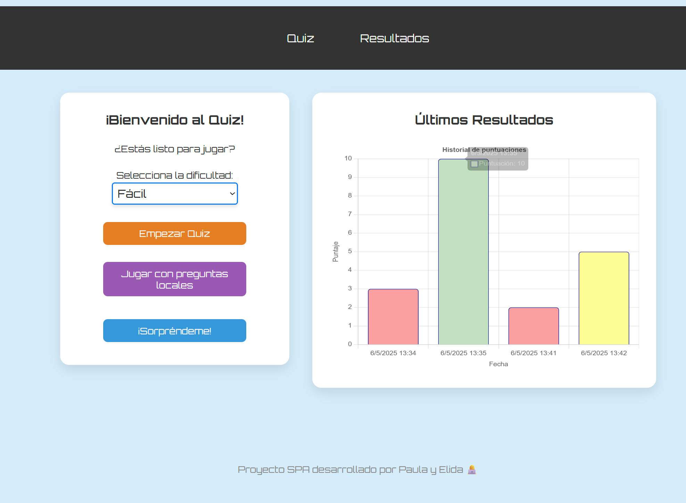
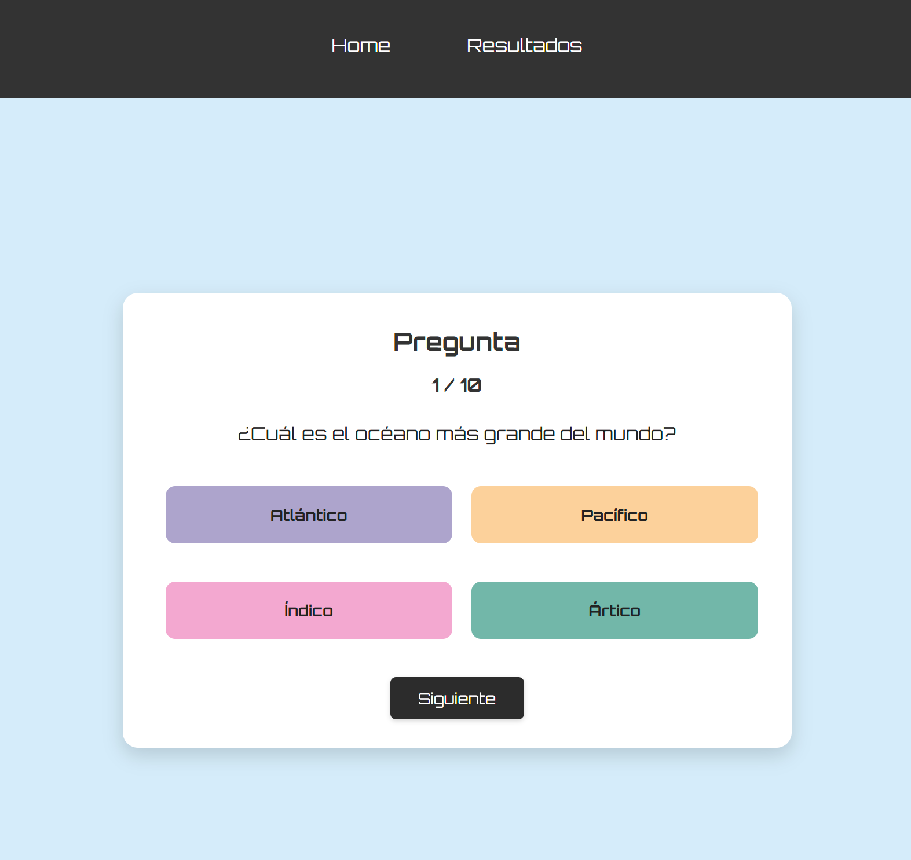
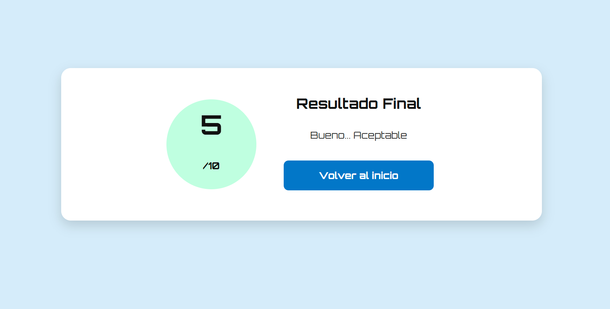

# Proyecto Quiz SPA 🧠✨

Este proyecto es una **Single Page Application (SPA)** que permite a los usuarios realizar un quiz de preguntas y ver sus resultados visualizados en gráficas. Fue desarrollado con HTML, CSS y JavaScript, y organiza el código en módulos para mantener una estructura clara y escalable.

---

## 📁 Estructura del Proyecto

```
📦 proyecto-Quiz-JS/
│
├── assets/                          # Archivos multimedia del proyecto
│   ├── home.png                     # Captura de la vista Home
│   ├── quiz-time.png                # Imagen representativa del juego
│   └── result.png                   # Imagen de la vista de resultados
│
├── css/                             # Estilos organizados en archivos modulares
│   ├── base.css                     # Variables, fuentes y estilos globales
│   ├── buttons.css                  # Botones generales y personalizados
│   ├── home.css                     # Estilos exclusivos para la vista de inicio
│   ├── layout.css                   # Distribución general (flexbox, espaciado, márgenes)
│   ├── nav.css                      # Estilos del menú de navegación superior
│   ├── quiz.css                     # Estilos del juego: preguntas y opciones
│   ├── responsive.css               # Adaptaciones para pantallas pequeñas (media queries)
│   ├── results.css                  # Vista de resultados con puntaje y mensaje final
│   └── styles.css                   # Archivo auxiliar opcional (puede eliminarse si no se usa)
│
├── js/                              # Scripts JavaScript organizados
│   ├── data.js                      # Preguntas locales y funciones de obtención de datos
│   ├── main.js                      # Lógica principal de SPA: navegación y control de vistas
│   └── results.js                   # Lógica específica de la pantalla de resultados (si aplica)
│
├── home.html                        # Página inicial: selección de tipo de juego + gráfica
├── question.html                    # Página del quiz: muestra preguntas y opciones
├── results.html                     # Página de resultados con puntaje final
│
├── README.md                        # Documentación del proyecto y cómo ejecutarlo
└── .prettierrc                      # Configuración de formato de código (opcional)

## 🧩 Tecnologías usadas

-   HTML5 + CSS3
-   JavaScript moderno (ES Modules)
-   Chart.js para visualización de resultados
-   localStorage para persistencia de datos

---

## API Usada

#### The-Trivia-API

https://the-trivia-api.com

## 📌 Cómo usar el proyecto

1. Clona el repositorio o descarga el ZIP
2. Abre `home.html` en tu navegador
3. Selecciona un tipo de preguntas y comienza el quiz 🎉

---

## 📌 Ejemplo de uso





## 🧑‍💻 Créditos

Desarrollado por **Paula & Elida** como parte del proyecto de aprendizaje en desarrollo web 🥳

-   [@Elimila](https://www.github.com/elimila)
-   [@PaulaVegas](https://www.github.com/PaulaVegas)
